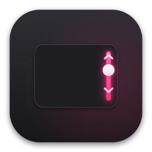

<div align="center">



# Verge

**Slide the verge.**
Trackpad-edge control for volume, brightness, and video on macOS.

<p>
  
  
  
  
</p>

### [⬇ Download Verge.dmg](https://github.com/cyborgsuh/verge/releases/latest)

</div>

---

A lightweight macOS menu-bar app — no window, no clutter. Slide a single finger along a trackpad edge to adjust:

| Edge | Controls |
|------|----------|
| **Right** | Volume |
| **Left** | Brightness |
| **Top** | Video scrub (1s where the player allows, else 5s) |

Fine ~1.6% steps, taptic detent feedback, the cursor freezes while you slide, and it ignores scrolls, pinches, swipes, and typing — so it never triggers by accident.

## Install

1. Download `Verge.dmg` from [Releases](https://github.com/cyborgsuh/verge/releases/latest).
2. Open it, drag **Verge → Applications**.
3. First launch: **right-click Verge → Open → Open** (it's not notarized, so macOS warns once).
   - Or run: `xattr -dr com.apple.quarantine /Applications/Verge.app`
4. Grant **Accessibility** when prompted (System Settings → Privacy & Security → Accessibility). Needed to post the volume/brightness keys.

Opens at login automatically after first run — toggle it off in Preferences or the menu.

## Requirements

- macOS 13 (Ventura) or later
- A MacBook trackpad or Magic Trackpad

## Preferences

Menu-bar icon → **Preferences** (⌘,): enable/disable, swap which edge does what, edge distance, sensitivity, video scrub, cursor freeze, open at login.

## Build from source

```bash
./build.sh          # builds Verge.app
./make_dmg.sh       # builds the branded Verge.dmg installer
```

Pure `swiftc` + AppKit — no Xcode project, no dependencies.

<div align="center">
<sub>Made with 🩷 &nbsp;·&nbsp; <code>#FF2E7E</code></sub>
</div>
